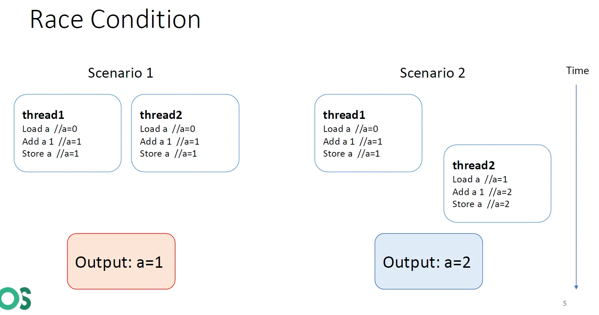
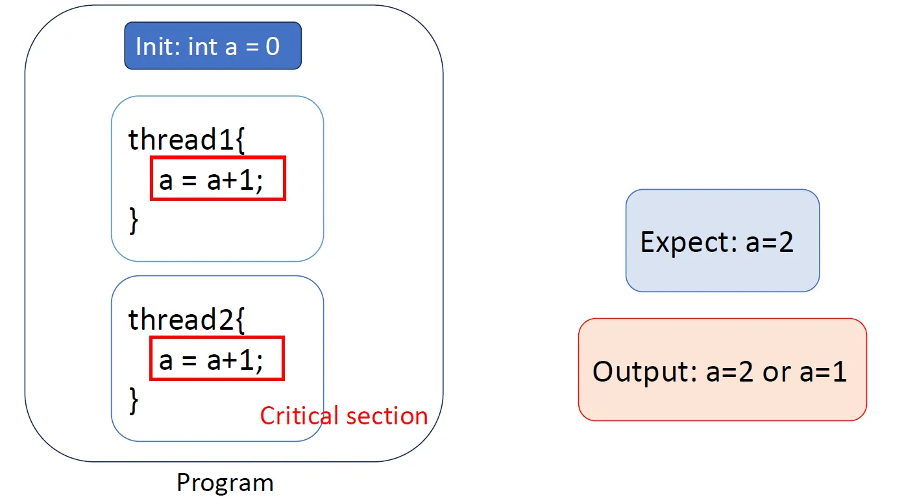
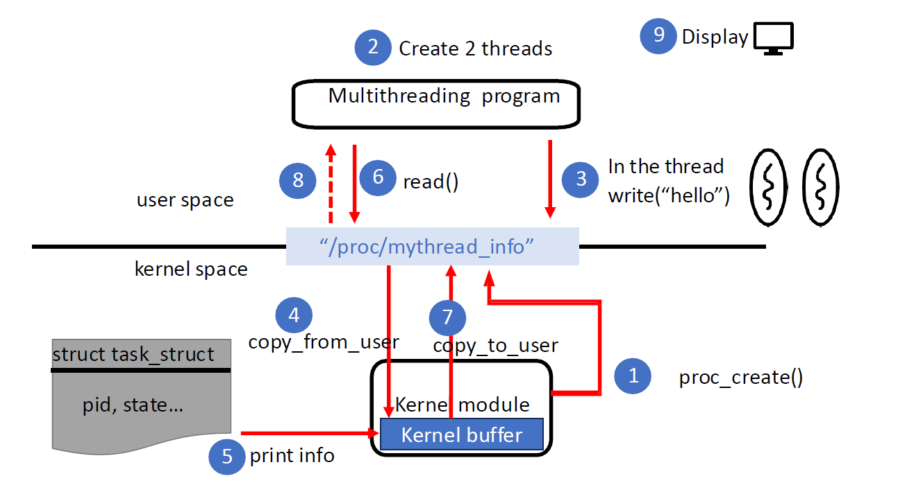
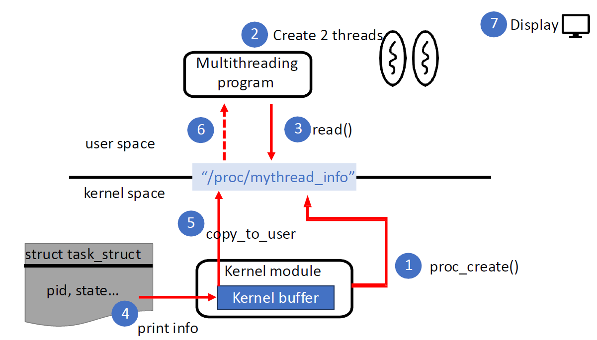

#  Lab3 Concepts

## Multithread
* `race condition`: multi-thread or multi-process 在運行時，可能同時 access 同一塊記憶體區塊，而造成此區塊的不可預期
    
* `critical section`: 需要確保 “同一時間只有一個 thread“ 能執行的區域，稱為 critical section
    

## The /proc filesystem
* 用途
    * 最初的功能: 讓 kernel, kernel modules 能去 access process 的資訊
    * 現在的功能: 除了以上的功能以外，還有其他像是 modules, memory 等相關 kernel 資訊也能透過 /proc filesystem 去取得
        ```bash
        $ cat /proc/meminfo
        $ cat /proc/modules
        ```
* 概念
    * 其實 /proc 是個 pseudo/virtual filesystem，他並不會掛載到 disk 上面，而是只存在在 memory 中，所以斷電的話 /proc 就會清掉，開機再重建

* 歷史
    * 在以前的 UNIX 中，透過 `ps` 去 access processes 的資訊，而要獲取 processes 的資訊就必須經由 read from kernel's virtual memory 去取得，所以 `ps` 必須在實作成 privileged program 才能取得資訊
    * 而如今的 Linux 則不需要讓 `ps` 做成 privileged program，用一般的 program 時做就好，不須特權。/proc 的內容是由 kernel 及時產生的資訊，所以如果要 processes 資訊的話就簡單地 parse files 的內容就好。

## 實作相關筆記
* 當有人 access(read/write) /proc/<procfile_name> 時，就會去啟動這個 procfile 的 kernel module，然後執行註冊於這個 procfile kernel module 內部 structure 的 read/write function 去工作
    
    

* read /proc
    
* write /proc
    

* How to program /proc filesystem?
    * use a structure called `struct proc_ops`(from [<linux/proc_fs.h>](https://git.kernel.org/pub/scm/linux/kernel/git/stable/linux.git/tree/include/linux/proc_fs.h)) to register handlers
        ```C
        struct proc_ops {
            unsigned int proc_flags;
            int	(*proc_open)(struct inode *, struct file *);
            ssize_t	(*proc_read)(struct file *, char __user *, size_t, loff_t *);
            ssize_t (*proc_read_iter)(struct kiocb *, struct iov_iter *);
            ssize_t	(*proc_write)(struct file *, const char __user *, size_t, loff_t *);
            /* mandatory unless nonseekable_open() or equivalent is used */
            loff_t	(*proc_lseek)(struct file *, loff_t, int);
            int	(*proc_release)(struct inode *, struct file *);
            __poll_t (*proc_poll)(struct file *, struct poll_table_struct *);
            long	(*proc_ioctl)(struct file *, unsigned int, unsigned long);
        #ifdef CONFIG_COMPAT
            long	(*proc_compat_ioctl)(struct file *, unsigned int, unsigned long);
        #endif
            int	(*proc_mmap)(struct file *, struct vm_area_struct *);
            unsigned long (*proc_get_unmapped_area)(struct file *, unsigned long, unsigned long, unsigned long, unsigned long);
        } __randomize_layout;
        ```
    * Lab3 要註冊 `proc_read`, `proc_write` 的 function pointers

## 實作
### 3.1
```C
/**
 * @brief when trigger a read of the procfile, this function is called.
 * 
 * @param fileptr    procfile
 * @param ubuf       string to user space
 * @param buffer_len how many bytes can be sended to user space, for instance: fgets(buffer, sizeof(buffer), fptr4)
 * @param offset     r/w head, offset > 0 means we finish this read, so do nothing
 *
 * @return           #bytes read
 */
static ssize_t Myread(struct file *fileptr, char __user *ubuf, size_t buffer_len, loff_t *offset){

    // when EOF, directly return, prevent infinite reads
    if (*offset > 0) return 0;

    // parse threads' info
    struct task_struct *thread;
    for_each_thread(current, thread) {
        if (current->pid == thread->pid) {
            continue;
        }
        *offset += sprintf(&buf[*offset], "PID: %d, TID: %d, Priority: %d, State: %d\n",
                          current->pid, thread->pid, thread->prio, thread->__state);
    }

    // send info to user space
    if (copy_to_user(ubuf, buf, buffer_len)) {
        pr_info("copy_to_user failed.\n");
        return -EFAULT;
    }

    return *offset > buffer_len ? *offset : buffer_len;
}
```

### Summary
* 註冊 `struct proc_ops` 中的 handlers
* 在 start fucntion 中: 使用 `proc_create()` 把 handlers 和 procfile 綁在一起
* 在 end function 中: 使用 `proc_remove()` 把 start function 中 `pro_create()` 出的 procfile object 刪掉

## Extra
### Index Node
* inode for short.
* 2 terms here:
    1. `inode`
    2. `i-number`: inode number
* 解釋:
    * 在 **同一個 filesystem** 中，會有自己的一張 i-number table；不同 filesystems 之間各擁有著各自的 tables
    * 在 **同一個 filesystem** 中，一個 file 則會有其唯一的 i-number，用來索引到這個 file 的 inode
    * inode 是一個 data structure，存放著這個 file 的各種資訊
        1. metadata: permission, owner, size, date
        2. a pointer to the file's data in disk
    * intuition: table[i-number] -> inode